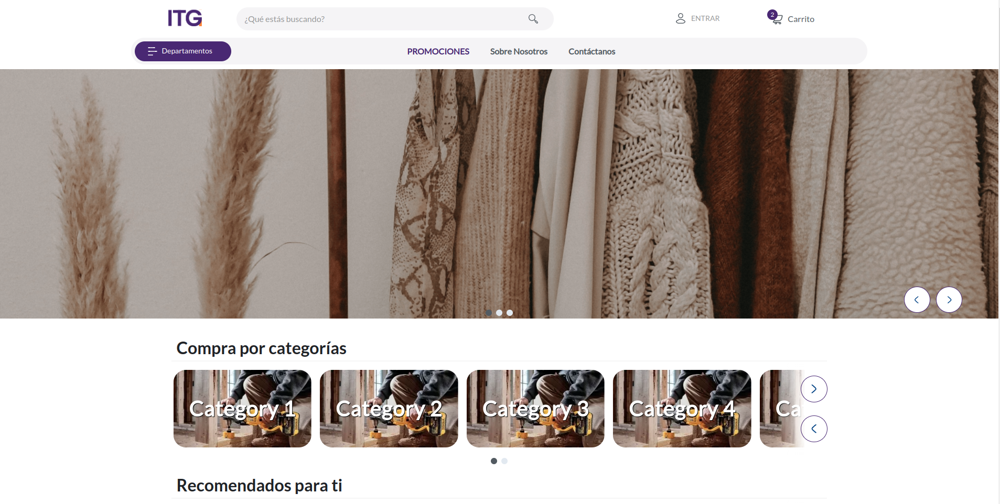
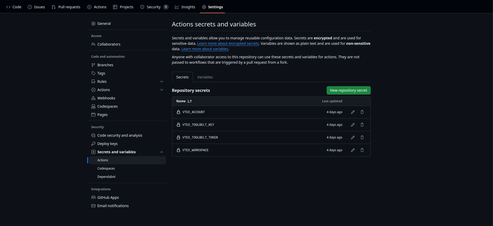

# IT Globers Store Theme

IT Globers Store Theme is basic store front model based on the VTEX IO Store Framework.

It should be used only when you want to start a new store theme without any pre-set configurations.

While Store Theme gives developers a ready-to-go default store front structure, the IT Globers Store Boilerplate Theme will enable you to build you store freely from scratch.

[Store Theme figma](https://www.figma.com/design/RxkklBSD8w3vaViVNZnIN2/MVP-Template-%7C-ITGlobers?node-id=640-8450&node-type=section&t=NpRtl6zrjUiZuqkX-0)

## Preview



<!-- Please include a screenshot for the home of the site that you are working. Example
-->

## Configuration

### Step 1 - Basic setup

Access the VTEX IO [basic setup guide](https://vtex.io/docs/getting-started/build-stores-with-store-framework/1) and follow all the given steps.

By the end of the setup, you should have the VTEX command line interface (Toolbelt) installed along with a developer workspace you can work in.

### Step 2 - Cloning the IT Globers Store Theme repository

[Use this template](https://github.com/itglobers/itglobers-store-theme/generate) repository to your local files to be able to effectively start working on it.

Then, access the repository's directory using your terminal.

### Step 3 - Editing the `Manifest.json`

Once in the repository directory, it is time to edit the Minimum Boilerplate `manifest.json` file.

Once you are in the file, you must replace the `vendor` and `account` values. `vendor` is the account name you are working on and `account` is anything you want to name your theme. For example:

```json
{
	"vendor": "itglobers",
	"name": "store-theme"
}
```

### Step 4 - Installing required apps

In order to use Store Framework and work on your store theme, it is needed to have both `vtex.store-sitemap` and `vtex.store` installed.

Run `vtex list` and check whether those apps are already installed.

If they aren't, run the following command to install them: `vtex install vtex.store-sitemap vtex.store -f`

### Step 5 - Uninstalling any existing theme

By running `vtex list`, you can verify if any theme is installed.

It is common to already have a `vtex.store-theme` installed when you start the store's front development process.

Therefore, if you find it in the app's list, copy its name and use it together with the command `vtex uninstall`. For example:

```json
vtex uninstall vtex.store-theme
```

### Step 6- Run and preview your store

Then time has come to upload all the changes you made in your local files to the platform. For that, use the `vtex link` command.

If the process runs without any errors, the following message will be displayed: `App linked successfully`. Then, run the `vtex browse` command to open a browser window having your linked store in it.

This will enable you to see the applied changes in real time, through the account and workspace in which you are working.

## Dependencies

All store components that you see on this document are open source too. Production ready, you can found those apps in this GitHub organization.

Store framework is the baseline to create any store using _VTEX IO Web Framework_.

- [Store](https://github.com/vtex-apps/store/blob/master/README.md)

### Store component dependencies

- [Header](https://github.com/vtex-apps/store-header/blob/master/docs/README.md)
- [Footer](https://github.com/vtex-apps/store-footer/blob/master/docs/README.md)
- [Slider Layout](https://github.com/vtex-apps/slider-layout/blob/master/docs/README.md)
- [Shelf](https://github.com/vtex-apps/shelf/blob/master/docs/README.md)
- [Telemarketing](https://github.com/vtex-apps/telemarketing/blob/master/docs/README.md)
- [Menu](https://github.com/vtex-apps/menu/blob/master/docs/README.md)
- [Login](https://github.com/vtex-apps/login/blob/master/docs/README.md)
- [Minicart](https://github.com/vtex-apps/minicart/blob/master/docs/README.md)
- [Category Menu](https://github.com/vtex-apps/category-menu/blob/master/docs/README.md)
- [Product Summary](https://github.com/vtex-apps/product-summary/blob/master/docs/README.md)
- [Breadcrumb](https://github.com/vtex-apps/breadcrumb/blob/master/docs/README.md)
- [Search Result](https://github.com/vtex-apps/search-result/blob/master/docs/README.md)
- [Product Details](https://github.com/vtex-apps/product-details/blob/master/docs/README.md)
- [Store Components](https://github.com/vtex-apps/store-components/blob/master/docs/README.md)
- [Order Placed](https://github.com/vtex-apps/order-placed/blob/master/docs/README.md)

### Peer store component dependencies

### Custom component dependencies

## Cypress configuration

Next, we'll learn how to use Cypress in VTEX. You'll learn how to run Cypress locally, understand how the GitHub actions in this repository function, know how to execute tests, and understand the workings of the test-running script.

> [!NOTE]
> Cypress can only run **locally** for Linux or MacOS users

### Step 1 - Log in to your terminal

Before running Cypress in your local environment, make sure you are logged into your terminal using the `$ vtex login <account>` command. Otherwise, you will not be able to run the script responsible for running Cypress, since this script uses the session token. You can view this token using the `$ vtex local token` command.

### Step 2 - Install dependencies

Install cypress and typescript with the `$ yarn` command

> [!NOTE]
> 4.5.0 is the Cypress version IO runs your tests on, so we recommend you write and debug your tests using this version.

### Step 3 - Cypress json configuration

In the [cypress.json](../cypress.json) file, we are going to modify the `baseUrl` property by changing the values of `<workspace>` and `<account>`:

```json
{
	"baseUrl": "https://<workspace>--<account>.myvtex.com"
}
```

### Step 4 - Script configuration

replace the `<workspace>` and `<account>` values with the values you had previously put in [cypress.json](../cypress.json)

```sh
sed -e "s/<workspace>/\$workspace/" -e "s/<account>/\$account/" cypress.json > $resolvedConfig
```

This script will resolve the `baseUrl` configured in your [cypress.json](../cypress.json) file using the currently logged-in account and workspace, and also expose the user's local token through the `CYPRESS_authToken` environment variable.

create a shortcut in the [package.json](../package.json) to run the script in your terminal

```json
{
	"scripts": {
		"cypress:open": "./cypress-local.sh open",
		"cypress:run": "./cypress-local.sh run"
	}
}
```

#### Differences between `cypress:open` and `cypress:run`

- `cypress:open`

  - Running cypress open opens the Cypress graphical interface.
  - This interface allows you to select and run tests interactively.
  - Provides a real-time view of tests, including step execution, HTTP requests, execution time, number of tests passed and failed, as well as the ability to view screenshots of specific actions.
  - It is useful for test development and debugging as it offers an interactive way of working with Cypress.

```sh
yarn run cypress:open
```

- `cypress:run`
  - When you run cypress run, Cypress runs the tests in command line mode, without opening the graphical interface.
  - This mode is faster, since it runs in memory and does not require the preparation of a graphical interface.
  - It is useful for integration into CI/CD pipelines, where automated test execution without human interaction is required.

```sh
yarn run cypress:run
```

### How the script works ?

```sh
token=$(vtex local token)
account=$(vtex local account)
workspace=$(vtex local workspace)
```

- These lines use VTEX tool commands to get the local token, account, and workspace. These values are stored in the token, account and workspace variables, respectively.

```sh
resolvedConfig="resolved-cypress.json"
```

- This line creates a variable called resolvedConfig and assigns it the value "resolved-cypress.json". This variable is used to store the name of the resolved configuration file.

```sh
sed -e "s/<workspace>/\$workspace/" -e "s/<account>/\$account/" cypress.json > $resolvedConfig
```

- This line uses the sed command to replace the `<workspace>` and `<account>` strings in the cypress.json file with the values of the `$workspace` and `$account` variables, respectively. The result is redirected to the $resolvedConfig file.

```sh
export CYPRESS_authToken=$token
```

- This line exports the value of the token variable as an environment variable called `CYPRESS_authToken`. This allows the token value to be used in other commands or scripts.

```sh
cmd=$1
shift
```

- These lines assign the first argument passed to the script to the cmd variable and then shift the remaining arguments.

```sh
yarn cypress $cmd -C $resolvedConfig "$@" --browser chrome
```

- This line runs the yarn cypress command with the arguments provided to the script, using the $resolvedConfig configuration file and the Chrome browser.

```sh
rm $resolvedConfig
```

- This line deletes the $resolvedConfig file after the script execution has completed.

> [!NOTE]
> Important: **Don't run** `$ git add resolve-cypress.json` for the `resolve-cypress.json` file; As mentioned, this file is constantly created and automatically deleted in your local environment.

### Cypress folder architecture

All Cypress related code is located in the cypress folder and within that folder it is distributed as follows:

- **Folder** `cypress/integration`:

  - This folder contains Cypress tests.
  - This is where test files are created, usually with the `.spec.js` or `.spec.ts` extension.
  - Test files can be organized in subfolders according to the structure you want.

- **Folder** `cypress/support`:

  - This folder contains support files for the tests.
  - This is where custom commands, utility functions and additional settings can be defined.

- **Folder** `cypress/fixtures`:

  - This folder is used to store "variables" or reusable data.
  - You can place `JSON`, `CSV` files or other data formats here to use in your tests.

### How the Test Add to cart from PDP works

The function of this test is to add a product to the cart from the PDP. This process is carried out as follows:

- Before running the test, the custom command `setVtexIdCookie` is called to set a VTEX ID cookie.

```ts
import "../support/vtex";

describe("Add to cart from PDP", () => {
  before(() => {
    cy.setVtexIdCookie();
  });
  ...
});
```

- The test begins by visiting the main page (home) using the command `cy.visit("/")`. It is important to emphasize that for the test to work correctly, it must start from home, since it selects a product-summary from home.
  The `cy.wait(3000)` is for the page to load properly to prevent errors.

```ts
it("Click on a product to go to the PDP and add it to the shopping cart", () => {
  cy.visit("/");
  cy.wait(3000);
  ...
});
```

- The `cy.fixture()` function is used to load a JSON file called `addToCartFromPDP`. The content of the file is passed as an argument to the callback function. In this case, the content of the file is assigned to the contentElement variable.

```ts
it("Click on a product to go to the PDP and add it to the shopping cart", () => {
  cy.visit("/");
  cy.wait(3000);
  cy.fixture("addToCartFromPDP").then((contentElement) => {
     ...
  });
});
```

- The `cy.get()` function is used to select an element from the DOM. Selects an element that matches the `contentElement.productSummary` CSS selector. The CSS selector is obtained from the content of the `addToCartFromPDP` JSON file. After the element is selected, a callback function is chained using `.then()`. This callback function takes the selected content and uses the `.eq()` method to select a specific element within the elements collection. The element index is randomly generated using `Math.random()` and `Math.floor().`, once the desired element is selected, the `.click()` method is called to simulate a click on the element.

```ts
it("Click on a product to go to the PDP and add it to the shopping cart", () => {
  cy.visit("/");
  cy.wait(3000);
  cy.fixture("addToCartFromPDP").then((contentElement) => {
    cy.get(contentElement.productSummary)
      .then((content) => content.eq(Math.floor(Math.random() * content.length)))
      .click();
      ...
  });
});
```

- In this part of the code we again use `cy.get()` to select the elements from the DOM. In this case we are going to use the CSS selectors `contentElement.colorSkuOption` and `contentElement.sizeSkuOption` that are obtained from the JSON file `addToCartFromPDP` to select the skus. After selecting the elements, a callback function is chained that uses the `.then()` method to pass the selected content to the `cy.chooseRandomSku()` function. The `chooseRandomSku` function is a custom function defined in Cypress that the provided code adds as a new Cypress command.

```ts
it("Click on a product to go to the PDP and add it to the shopping cart", () => {
  cy.visit("/");
  cy.wait(3000);
  cy.fixture("addToCartFromPDP").then((contentElement) => {
    cy.get(contentElement.productSummary)
      .then((content) => content.eq(Math.floor(Math.random() * content.length)))
      .click();
    cy.wait(2000);

    cy.get(contentElement.colorSkuOption).then((content) =>
      cy.chooseRandomSku(content)
    );

    cy.wait(1000);

    cy.get(contentElement.sizeSkuOption).then((content) =>
      cy.chooseRandomSku(content)
    );
    ...
  });
});
```

- In this part of the test we add the product to the cart by doing `cy.get()` to obtain the element from the DOM, we pass to `cy.get()` the CSS selector `contentElement.addToCartButton` that comes from the JSON file " addToCartFromPDP". To that selected element we concatenate a `.click()` to resemble a click.

```ts
it("Click on a product to go to the PDP and add it to the shopping cart", () => {
  cy.visit("/");
  cy.wait(3000);
  cy.fixture("addToCartFromPDP").then((contentElement) => {
    cy.get(contentElement.productSummary)
      .then((content) => content.eq(Math.floor(Math.random() * content.length)))
      .click();
    cy.wait(2000);

    cy.get(contentElement.colorSkuOption).then((content) =>
      cy.chooseRandomSku(content)
    );

    cy.wait(1000);

    cy.get(contentElement.sizeSkuOption).then((content) =>
      cy.chooseRandomSku(content)
    );

    cy.wait(3000);
    cy.get(contentElement.addToCartButton).click();
    ...
  });
});
```

- And finally to open the shopping cart we do `cy.get()` to get the element from the DOM, we use the CSS selector `contentElement.cartButton` that comes from the JSON file "addToCartFromPDP" and then we concatenate a `.click()`.

```ts
it('Click on a product to go to the PDP and add it to the shopping cart', () => {
	cy.visit('/')
	cy.wait(3000)
	cy.fixture('addToCartFromPDP').then((contentElement) => {
		cy.get(contentElement.productSummary)
			.then((content) => content.eq(Math.floor(Math.random() * content.length)))
			.click()
		cy.wait(2000)

		cy.get(contentElement.colorSkuOption).then((content) =>
			cy.chooseRandomSku(content)
		)

		cy.wait(1000)

		cy.get(contentElement.sizeSkuOption).then((content) =>
			cy.chooseRandomSku(content)
		)

		cy.wait(3000)
		cy.get(contentElement.addToCartButton).click()

		cy.get(contentElement.cartButton).wait(500).click()
	})
})
```

### How does the chooseRandomSku function work

The function is located in the following path cypress/support/commands.ts

- The `chooseRandomSku` function takes a content Element parameter which is a jQuery object.

```ts
const chooseRandomSku = (contentElement: JQuery<any>) => {
  ...
};
```

- Inside the function, jQuery's `.filter()` method is used to filter the elements of the contentElement object. Items that do not have the `vtex-store-components-3-x-skuSelectorItem--selected` CSS class are filtered out.

```ts
const chooseRandomSku = (contentElement: JQuery<any>) => {
  const elementsWithoutClass = contentElement.filter(
    (index: number, element: any) =>
      !Cypress.$(element).hasClass(
        "vtex-store-components-3-x-skuSelectorItem--selected"
      )
  );
  ...
};
```

- It checks if there are filtered items available to select. If the length of `elementsWithoutClass` is greater than zero, it means that there are elements without the class `vtex-store-components-3-x-skuSelectorItem--selected` and one can be selected randomly. Cypress's `.wrap()` method is used to wrap the randomly selected element in a Cypress object. The `.click()` method is then called to simulate a click on the element.

```ts
const chooseRandomSku = (contentElement: JQuery<any>) => {
	const elementsWithoutClass = contentElement.filter(
		(index: number, element: any) =>
			!Cypress.$(element).hasClass(
				'vtex-store-components-3-x-skuSelectorItem--selected'
			)
	)
	if (elementsWithoutClass.length > 0)
		cy.wrap(
			elementsWithoutClass[
				Math.floor(Math.random() * elementsWithoutClass.length)
			]
		).click()
}
```

The code adds the chooseRandomSku function as a new Cypress command using `Cypress.Commands.add()`. This allows the function to be used as a custom command in Cypress tests.

```ts
const chooseRandomSku = (contentElement: JQuery<any>) => {
	const elementsWithoutClass = contentElement.filter(
		(index: number, element: any) =>
			!Cypress.$(element).hasClass(
				'vtex-store-components-3-x-skuSelectorItem--selected'
			)
	)
	if (elementsWithoutClass.length > 0)
		cy.wrap(
			elementsWithoutClass[
				Math.floor(Math.random() * elementsWithoutClass.length)
			]
		).click()
}

Cypress.Commands.add('chooseRandomSku', chooseRandomSku)
```

- The code declares a custom namespace in Cypress to extend the Chainable interface and add the `chooseRandomSku` command. This allows the command to be used seamlessly in Cypress command strings.

```ts
const chooseRandomSku = (contentElement: JQuery<any>) => {
	const elementsWithoutClass = contentElement.filter(
		(index: number, element: any) =>
			!Cypress.$(element).hasClass(
				'vtex-store-components-3-x-skuSelectorItem--selected'
			)
	)
	if (elementsWithoutClass.length > 0)
		cy.wrap(
			elementsWithoutClass[
				Math.floor(Math.random() * elementsWithoutClass.length)
			]
		).click()
}

Cypress.Commands.add('chooseRandomSku', chooseRandomSku)

declare namespace Cypress {
	interface Chainable<Subject> {
		chooseRandomSku(contentElement: JQuery<any>): Chainable<void>
	}
}
```

### Github actions

This workflow is triggered on **push** events to the **master** and **main** branches, as well as on the **workflow_dispatch** event that allows manual execution of the workflow.

```yml
on:
  push:
    branches:
      - master
      - main
  workflow_dispatch:
```

#### Job

The **cypress** job is the only job defined in this workflow.

- **Name**: Cypress Test
- **Execution Environment**: ubuntu-latest
- **Timeout**: 2 minutes

```yml
jobs:
  cypress:
    name: Cypress Test
    runs-on: ubuntu-latest
    timeout-minutes: 2
    steps:
    ...
```

#### Steps

The **cypress** job consists of multiple steps that are executed sequentially:

- **Checkout code**: This step uses the `actions/checkout@v4` action to clone the repository code into the execution environment.

```yml
- name: Checkout code
  uses: actions/checkout@v4
```

- **Set up Node.js**: This step uses the `actions/setup-node@v4` action to set up the Node.js version in the execution environment. In this case, version 14 of Node.js is used.

```yml
- name: Set up Node.js
  uses: actions/setup-node@v4
  with:
    node-version: 18
```

- **Install dependencies**: This step runs the command yarn install to install project dependencies.

```yml
- name: Install dependencies
  run: yarn install
```

- **Deploy toolbelt and login**: This step uses the `vtex/action-toolbelt@v8` action to deploy the VTEX command-line tool and perform login to a VTEX account. Secret variables are used to provide account, key, token, and as well as the workspace. More info of [action-toolbelt](https://github.com/vtex/action-toolbelt?tab=readme-ov-file)

```yml
- name: Deploy toolbelt and login
  uses: vtex/action-toolbelt@v8
  with:
    account: ${{ secrets.VTEX_ACCOUNT }}
    appKey: ${{ secrets.VTEX_TOOLBELT_KEY }}
    appToken: ${{ secrets.VTEX_TOOLBELT_TOKEN }}
    authenticate: true
    workspace: ${{ secrets.VTEX_WORKSPACE }}
    bin: vtex
    version: 3.0.0-beta-ci.3
```

Make sure to add the secrets to the repository.


- **Run Cypress tests**: This step executes the script `./cypress-local.sh run` to run Cypress tests.

```yml
- name: Run Cypress tests
  run: ./cypress-local.sh run
```
